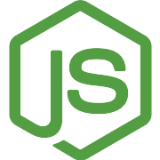

# HELLO THERE!!

This profile is intended for personal projects or related to my hobbies

Let's work together - [Laboral profile](https://github.com/sergiomunozge-dev)

---

<table>
  <tr>
    <td width="300px" valign="top">
      
    </td>
    <td valign="top">
      <h2>I'm Sergio Muñoz Gesell</h2>
      
Passionate about <b>web, mobile, and desktop programming</b>. I enjoy building software from the ground up, exploring <b>Linux operating systems</b>, and diving deep into the worlds of <b>video games and retro tech</b>.
    </td>
  </tr>
</table>

<table>
  <tr>
    <td valign="middle">
      <h3>🚀 Transforming Ideas into Code</h3>
      
I am passionate about bringing abstract concepts straight to the screen, turning them into <b>interactive, efficient, and creative digital experiences</b>. I don't just write code; I focus on building user-friendly interfaces backed by solid architecture.

      
💡 <b>Have a project in mind?</b> 
      I am actively seeking new challenges, exciting projects, and teams to collaborate with. Let's bring those ideas to life!

      
✨ <i>Open to work and collaborate on new ideas!!</i>

    </td>
    <td width="300px" valign="top">
      
    </td>
  </tr>
</table>

---

## MY STACK

<table>
  <tr>
    <td align="center" width="auto">
       
      <b>React</b>
    </td>
    <td align="center" width="16.6%">
       
      <b>MongoDB</b>
    </td>
    <td align="center" width="16.6%">
       
      <b>Docker</b>
    </td>
    <td align="center" width="16.6%">
       
      <b>NodeJS</b>
    </td>
    <td align="center" width="16.6%">
       
      <b>JS (and TS)</b>
    </td>
    <td align="center" width="16.6%">
       
      <b>Linux</b>
    </td>
  </tr>
</table>

---

## COURSES

* [ACADEMIA HOLAMUNDO - SO LINUX](https://academia.holamundo.io/certificates/itntm0qbm0)
* [ACADEMIA HOLAMUNDO - DOCKER](https://academia.holamundo.io/certificates/gqof8980gk)
* [ACADEMIA HOLAMUNDO - JS](https://academia.holamundo.io/certificates/a1bqxglfyr)
